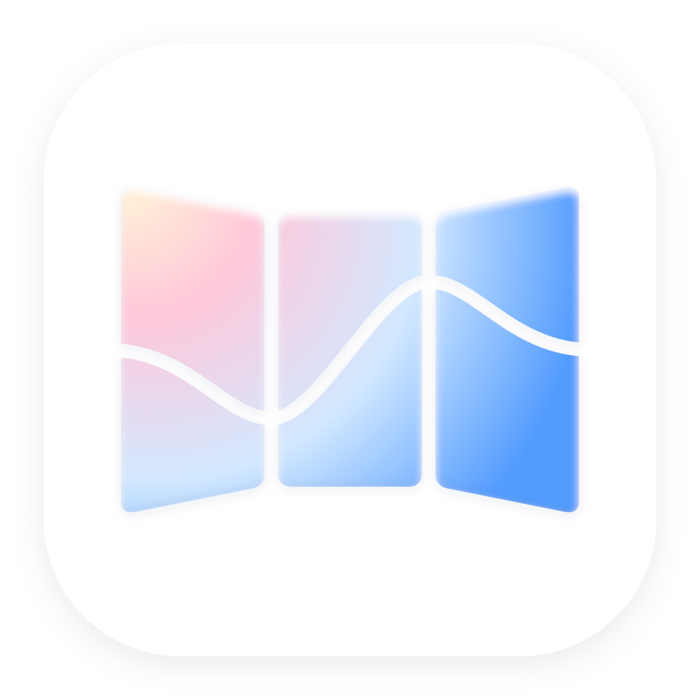
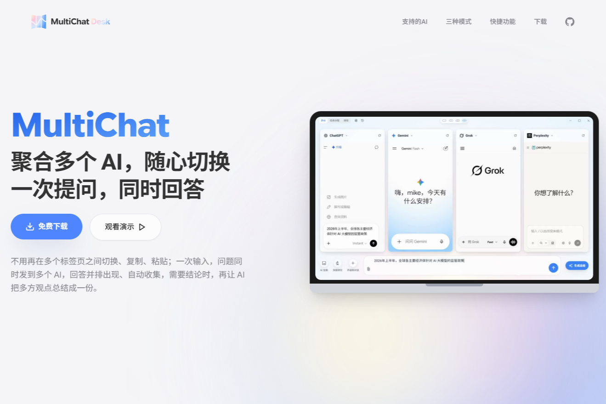
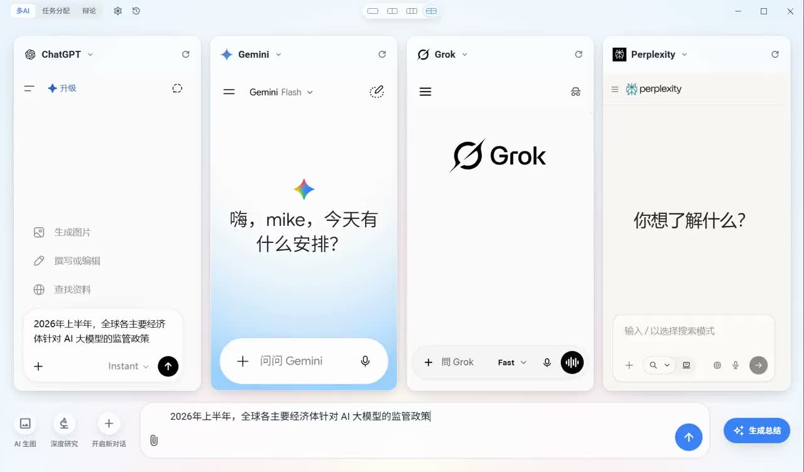
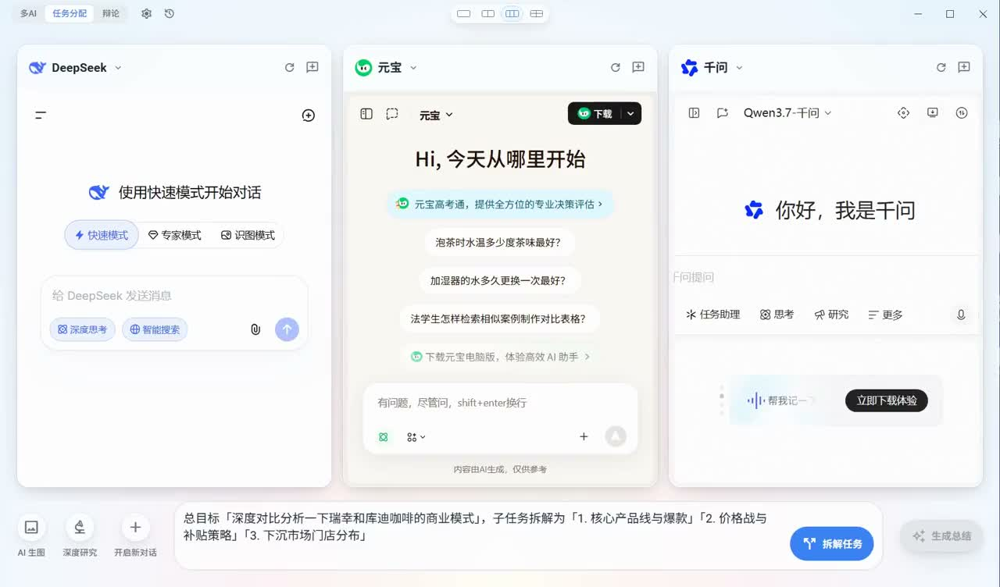
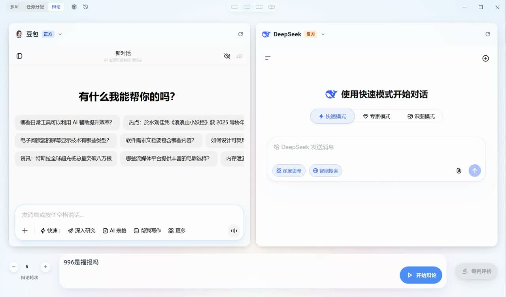

<table width="100%" border="0" cellpadding="0" cellspacing="0">
  <tr>
    <td align="left" valign="middle" width="80">
      
    </td>
    <td align="left" valign="middle">
      <div><strong><big>MultiChat Desk</big></strong></div>
    </td>
    <td align="right" valign="middle">
      <a href="#product">产品简介</a> ·
      <a href="#workflows">三种工作流</a> ·
      <a href="#summary">总结模式</a> ·
      <a href="#capabilities">核心能力</a> ·
      <a href="#download">下载</a> ·
      <a href="#developer">开发</a>
    </td>
  </tr>
</table>

<hr />

<div align="center">
  <p><strong>聚合多个 AI，随心切换；一次提问，同时回答</strong></p>
  <p>把多个 AI 平台放进同一个桌面工作区：并排对比、智能拆解、自动辩论，再让 AI 帮你收敛结论。</p>
  <p>
    <a href="https://github.com/max-doo/MultiChat-desk/releases"></a>
    <a href="https://github.com/max-doo/MultiChat-desk/releases"></a>
    <a href="https://github.com/max-doo/MultiChat-desk/blob/main/LICENSE"></a>
    <a href="https://www.electronjs.org/"></a>
  </p>
</div>

<p align="center">
  
</p>

> MultiChat Desk 面向需要比较答案、交叉验证、拆解复杂任务或快速处理桌面选区的 AI 重度用户。它直接承载各 AI 平台的网页体验，再用统一输入、历史记录和总结链路把多个回答组织起来。

<a id="product"></a>
## ✨ 产品简介

### 一个窗口，完成从提问到收敛的完整链路

不用在多个浏览器标签页之间来回切换、复制和粘贴：

1. 在统一输入框写下问题。
2. 让多个 AI 同时回答，并排比较差异。
3. 需要结论时，交给总结模型去重、纠错、综合或生成成稿。

<p align="center">
  
</p>

### 📤 统一消息发送
- **两步发送机制**：
  1. 输入内容并确认（文字会填入各模型输入框）
  2. 再次点击发送按钮，统一触发所有模型
- **安全取消**：确认前可取消，清空所有已输入内容

### 📎 文件上传
- **多格式支持**：
  - 图片：JPG、PNG、GIF、WebP
  - 文档：PDF、TXT、DOCX、Markdown
  - 表格：CSV、XLSX
  - 代码：JSON、JS、TS、PY、HTML、CSS 等多种代码文件
- **便捷交互**：支持直接拖拽文件到输入框区域进行上传
- **并行上传**：同时上传到所有显示的模型，节省时间


### 支持的 web 端 AI

内置 13 个主流 web 端 AI：
  -  Gemini (Google)
  -  Grok (xAI)
  - Claude (Anthropic)
  - ChatGPT (OpenAI)
  - Perplexity
  - DeepSeek
  - 千问 (阿里)
  - Kimi (月之暗面)
  - 豆包 (字节跳动)
  - 元宝 (腾讯)
  - 智谱清言 (智谱 AI)
  - 文心一言 (百度)
  - Arena (LMSYS Chatbot Arena)

每个平台仍保留自己的网页能力；MultiChat Desk 负责统一布局、输入、发送、历史和跨窗口自动化。网页平台的登录、网络连通性与 DOM 变化可能影响实际可用性。

<a id="workflows"></a>
## 🎯 一个工具，三种工作流

横向对比、智能拆解、辩论对抗——三种模式对应三种不同的思考方式。

| 多 AI 模式 · 横向对比 | 任务分配模式 · 智能拆解 | 辩论模式 · 全自动对抗 |
| --- | --- | --- |
|  |  |  |
| 同一问题同时发给多个 AI，回答并排出现，适合对比质量、验证事实、获得多角度意见。 | 输入总目标，AI 自动拆解成子任务，按窗口分配、可编辑，再一键发送。 | 两个窗口作为正反方轮流发言，完成多轮攻防后交给裁判总结。 |

### 多 AI 模式

- 支持单列、双列、三列、四窗布局。
- 统一输入，一次发送到当前显示的多个平台。
- 每个 Webview 独立运行，方便保留不同平台的原生能力和上下文。
- 可批量开启支持平台的 Deep Research 或 AI 生图模式。

### 任务分配模式

- 使用已配置的总结模型拆解总目标。
- 子任务支持编辑、增删和切换指派窗口。
- 按窗口槽位分发，适合资料搜集、方案比较、分工调研等并行任务。
- 完成后可进入“成稿汇总”流程，把多个子任务结果合成可交付内容。

### 辩论模式

- 两个窗口分别承担正方和反方。
- 支持 1–10 轮辩论，自动推进立论、交锋和结辩流程。
- 自动引用上一轮发言并轮流发送，减少手动协调。
- 辩论结束后由“辩论裁决”总结按轮次追踪攻防、评分并给出裁决。

<a id="capabilities"></a>
## 🧩 核心能力

<a id="summary"></a>
### AI 总结与分析

MultiChat Desk 不止负责“同时展示”，还提供独立的总结链路，用来读完多个窗口的回答后再做一次分析：

#### 总结来源：Web View 与 API 两种模式

总结有两种来源，当前默认使用 **Web View 模式**：

| 模式 | 说明 | 适合场景 |
| --- | --- | --- |
| **Web View 模式（默认）** | 通过已登录的厂商网页直接完成总结，不需要额外配置 API Key；总结过程仍发生在对应 AI 平台的网页窗口中。 | 希望直接复用网页版能力、登录态和平台原生功能 |
| **API 模式** | 通过 OpenAI 兼容接口调用独立的总结模型，需要配置供应商、Base URL、API Key 和模型。 | 希望使用指定 API 模型、统一参数或独立控制总结成本 |

在 **设置 → 总结方式** 中可以切换两种模式。Web View 模式是默认值；切换到 API 模式后，必须先完成下方的供应商和总结模型配置。

#### API 模式的最简配置

1. 打开 **设置 → 总结配置**，在“总结方式”中选择 **API 调用**。
2. 在“API 供应商”中点击新增，填写供应商名称、**Base URL** 和 **API Key**，保存后点击验证。
3. 在总结模型管理中添加或同步模型，选择对应供应商和模型；回到总结页即可使用 API 模式生成总结。

Base URL 需要填写供应商提供的 **OpenAI 兼容接口地址**，例如 OpenAI 常用 `https://api.openai.com/v1`，OpenRouter 常用 `https://openrouter.ai/api/v1`。更完整的供应商配置见 [API 配置与总结指南](docs/API_CONFIG_GUIDE.md)。

| 内置总结预设 | 适合场景 |
| --- | --- |
| **综合最佳** | 多模型去重、互补和纠错，输出更完整的综合答案 |
| **裁判找茬** | 查找事实错误、逻辑漏洞和不可靠表述 |
| **辩论裁决** | 分析辩论攻防、评分并给出最终裁决 |
| **成稿汇总** | 将任务分配模式的多个子任务结果合成为成稿 |

同时支持：

- OpenAI 兼容 API 供应商配置，可添加多个 Base URL、API Key 和模型。
- 嵌入式 Webview 总结来源，或独立 API 总结来源。
- 流式输出、思考内容展示、多轮追问和上下文轮数配置。
- 重新生成不覆盖原版本，可切换总结历史并导出 Markdown。
- 自定义总结提示词模板与 Temperature、Top-P、Max Tokens 等参数。

### 桌面副驾驶

走出 MultiChat Desk 主窗口，仍可把它当作桌面上的 AI 入口：

- **全局快捷弹窗**：默认使用 `Ctrl+Shift+Space`（macOS 对应 `Cmd+Shift+Space`）召唤独立悬浮窗口，可置顶常驻。
- **选区工具条**：在支持的平台上选中文本后，提供问问、搜索、总结、翻译、复制等动作。
- **划词即问**：将外部应用的选区带入快捷窗口或快捷操作，减少复制粘贴。
- 快捷键、总结、润色、翻译、纯文本入框和搜索动作均可在设置中自定义。

### 文件、历史与原生网页能力

- 支持将文件拖拽或粘贴到统一输入区域，并尝试同步到当前显示的模型窗口。
- 对话历史、总结历史和各模型 URL 均可本地保存、搜索、恢复和删除。
- 多个 Webview 共享 `persist:shared` Session；首次在各平台登录后，登录态可跨窗口保留。
- 应用不会把网页平台 Cookie 交给自建云端服务；总结 API 是否发送内容取决于你的配置和操作。
- 平台内置的网页能力仍由平台自身提供，平台改版或网络环境变化可能需要更新选择器配置。

### Deep Research 与 AI 生图

工具栏提供统一入口，按当前平台的选择器配置尝试开启深度研究或 AI 生图模式；不同平台支持范围不同，未配置的平台会明确提示不支持。AI 生图结果还支持检测和批量下载流程。

<a id="download"></a>
## 🚀 下载与首次使用

### 下载

- **Windows**：前往 [GitHub Releases](https://github.com/max-doo/MultiChat-desk/releases) 下载安装版或便携版。
- **macOS / Linux**：仓库提供对应构建脚本；正式发布物、平台权限和交互行为请以目标平台的实际验证结果为准。
- **产品介绍**：访问 [MultiChat Desk 落地页](https://multichat.top)。

### 首次启动

1. 启动后，在需要使用的平台窗口中分别完成登录。
2. 在顶部模式标签选择“多 AI”“任务分配”或“辩论”。
3. 在底部统一输入框输入问题并发送；首次发送会先填入各平台输入框，再由第二次确认触发统一发送。
4. 如果要使用 AI 总结，打开设置，添加一个兼容 OpenAI API 的供应商和模型，或切换到 Webview 总结来源。
5. 在总结页选择预设、模型和上下文设置；需要留档时导出 Markdown。


<a id="developer"></a>
## 🛠️ 开发与构建

### 技术栈

- Electron 42、React 18、TypeScript、Zustand
- Tailwind CSS、electron-vite、electron-builder
- 主进程负责窗口、Session、IPC、持久化和总结链路；渲染进程负责界面、状态和 Webview 交互；preload 只暴露安全桥接。

### 环境要求

- Node.js 20.x 或更高版本
- npm 10.x 或更高版本
- 网络连接；部分 AI 平台可能需要代理
- Windows 是当前主要开发和发布验证平台

项目只使用 npm，不使用 pnpm、yarn 或其他包管理器。

### 安装与开发

```bash
git clone https://github.com/max-doo/MultiChat-desk.git
cd MultiChat-desk
npm install
npm run dev
```

### 检查与构建

```bash
# 静态检查
npm run lint

# 构建 main / preload / renderer / CLI
npm run build

# Windows 安装版与便携版
npm run build:win:nsis
npm run build:win:portable
npm run build:win:all

# 在对应操作系统上构建
npm run build:mac
npm run build:linux
```

构建产物位于 `out/` 或 `dist/`。这两个目录是生成目录，不要手工修改。

### 项目结构

```text
src/
├── main/       # Electron 主进程：窗口、Session、IPC、持久化、总结 API
├── preload/    # 安全桥接与 IPC 类型契约
├── renderer/   # React 页面、状态、组件与 Webview 交互
├── shared/     # 主进程与渲染进程共享的选择器和工具
└── cli/        # CLI 与 daemon 相关入口
docs/           # 用户、构建、配置和设计文档
assets/         # 应用资源
```

第三方 AI 平台的 DOM 选择器集中维护在 [`src/shared/config/selectors.ts`](src/shared/config/selectors.ts)，注入脚本集中在 `src/shared/utils/` 与 `src/renderer/src/utils/`。调整平台自动化前，建议先阅读 [选择器维护方法论](docs/选择器维护方法论.md)。

<a id="faq"></a>
## ❓ 常见问题

### 为什么某个平台显示空白或无法发送？

先检查网络、代理和平台登录状态，再尝试刷新该窗口。第三方平台频繁改版时，也可能需要更新选择器；开发态可使用诊断页面定位输入框、发送按钮和回复容器。

### 为什么总结按钮不可用？

总结需要可用的总结来源：要么在设置中配置并验证兼容 OpenAI API 的供应商和模型，要么选择 Webview 总结方式。任务分配的“成稿汇总”和辩论的“辩论裁决”还需要先完成对应工作流。

### 登录信息和历史记录保存在哪里？

数据默认由 Electron 应用在本地持久化。安装版和便携版的存储位置不同，具体可参考 [用户使用指南](docs/USER_GUIDE.md) 和 [便携版构建指南](docs/PORTABLE_BUILD_GUIDE.md)。不要把包含 Cookie、API Key、历史内容的配置文件提交到 Git。

### 如何重置开发态配置？

```bash
npm run clean:store
```

该命令只清理开发态配置文件；执行前请确认不需要保留本地登录态、历史记录和 API 配置。

### 修改平台选择器后如何验证？

先运行 `npm run lint` 和 `npm run build`，再用 `npm run dev` 在真实桌面窗口中登录并触发对应平台的发送、收集、总结或上传流程。静态检查不能替代 Webview、焦点、鼠标和平台网页的实际验收。

<a id="links"></a>
## 🔗 项目链接

- [GitHub 仓库](https://github.com/max-doo/MultiChat-desk)
- [Releases 下载](https://github.com/max-doo/MultiChat-desk/releases)
- [Issues](https://github.com/max-doo/MultiChat-desk/issues)
- [Discussions](https://github.com/max-doo/MultiChat-desk/discussions)
- [产品落地页项目](https://github.com/max-doo/MultiChat-LP)

## 📄 许可证

本项目采用 [Apache License 2.0](LICENSE) 开源。

欢迎提交 Issue、完善平台选择器、改进文档或贡献代码。提交前请确保没有包含 API Key、Cookie、Token、私有密钥或真实用户数据。
