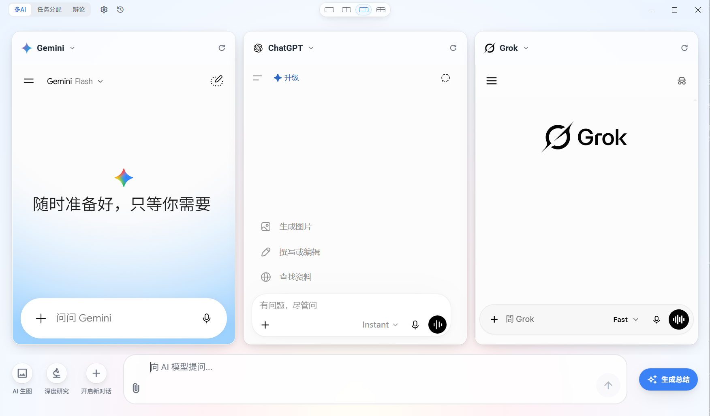

# MultiChat Desk

<p align="center">
  
  
  
  
  <br>
  <!-- GitHub Release -->
  <a href="https://github.com/max-doo/MultiChat-desk/releases">
    
  </a>
  <!-- Download Count -->
  <a href="https://github.com/max-doo/MultiChat-desk/releases">
    
  </a>
</p>

**MultiChat Desk** 是一款桌面端 AI 聚合工具——把多个 AI 平台并排到同一个桌面窗口里，一次输入，问题同时发到多个 AI，回答并排出现、自动收集；需要结论时，再让 AI 把多方观点总结成一份。走出应用窗口，它还能化身你的桌面副驾驶：任意位置召唤、任意选区处理。适用于模型对比、答案验证、多角度分析、学术研究、决策辅助等场景。

## 📑 目录

- [核心亮点](#-核心亮点)
- [三种工作流](#-三种工作流)
- [核心功能](#-核心功能)
- [快速开始](#-快速开始)
  - [环境要求](#环境要求)
  - [安装依赖](#安装依赖)
  - [开发模式](#开发模式)
  - [构建打包](#构建打包)
- [项目结构](#-项目结构)
- [技术栈](#️-技术栈)
- [配置说明](#️-配置说明)
  - [API 配置](#api-配置)
  - [模型管理](#模型管理)
  - [DOM 选择器配置](#dom-选择器配置)
- [支持的 API 供应商](#-支持的-api-供应商)
- [常见问题](#-常见问题)
- [使用技巧](#-使用技巧)
  - [高效对比模型](#高效对比模型)
  - [智能总结工作流](#智能总结工作流)
  - [自定义提示词](#自定义提示词)
  - [参数调优](#参数调优)
  - [历史记录管理](#历史记录管理)
- [开发计划](#-开发计划)
- [许可证](#-许可证)
- [贡献](#-贡献)

---

## ✨ 核心亮点

- 🌐 **聚合 13 个主流 AI**：一次输入，多个 AI 同时作答，回答并排呈现，无需逐个打开网页
- 🔀 **三种工作流**：多 AI 横向对比、任务分配智能拆解、辩论全自动对抗——覆盖对比、拆解、辩论三类场景
- 🤖 **智能 AI 总结**：兼容 OpenAI API 格式的多家供应商，4 种预设总结角色（综合最佳 / 裁判找茬 / 辩论裁决 / 成稿汇总），支持流式输出与思考过程可视化
- 🖱️ **系统级悬浮工具条**（Windows 专属）：在任意应用中选中文本即弹出胶囊条，问问 / 搜索 / 总结 / 翻译 / 复制，一键直达，不夺焦
- ⚡ **全局快捷弹窗**：`Ctrl+Shift+Space` 随时召唤独立悬浮 AI 窗口，支持划词即问、置顶常驻
- 🎨 **一键深度研究 / AI 生图**：在并排窗口上一键开启深度研究或 AI 生图，多个平台同步切换
- 💬 **多轮深度对话**：支持追问和上下文对话，像聊天一样使用
- 🧠 **思考过程可视化**：支持 o1/o3、DeepSeek-R1、Gemini 2.5、Qwen3 混合思考等推理模型
- 📊 **版本管理**：重新生成不覆盖，可自由切换历史版本
- 💾 **完整历史记录**：对话历史、总结历史、URL 记录全保存，内存热区 100 条 + 磁盘分页加载



---

## 🎯 三种工作流

MultiChat Desk 不只是"多窗口群发"，而是覆盖对比、拆解、辩论三类场景的三种工作流。

### 📊 多 AI 模式 · 横向对比

默认模式。同一问题同时发到多个 AI，回答并排出现、自动收集。横向对比质量、验证事实、多角度看问题。

- **1/2/3/4 多窗并行**：自由切换布局，默认 3 窗口，最多 4 窗口并行
- **一键群发**：统一消息发到所有平台，每个窗口独立运行互不干扰
- **一键深度研究 / 生图**：在并排窗口上一键开启深度研究或 AI 生图，多个平台同步切换

### 🧩 任务分配模式 · 智能拆解

输入总目标，大模型自动拆解为子任务，按窗口数匹配、可编辑，一键分发到各窗口。让多个 AI 各司其职。

- **AI 拆解子任务**：调用你配置的总结模型，把总目标分解为可执行子任务
- **可编辑可分配**：编辑文本、切换指派模型、增删子任务
- **按模型一键分发**：按子任务的模型分组，一键把每个子任务发到对应窗口

### ⚔️ 辩论模式 · 全自动对抗

两个窗口正反方全自动轮流发言，立论→交锋→结辩三阶段，结束后由裁判 AI 生成评分与最终裁决。

- **三阶段分层提示词**：立论、交锋、结辩，辩手引用对手上一轮发言
- **全自动轮流发言**：正反方交替自动反驳，打字机效果逐字呈现
- **裁判评析裁决**：结束后按轮次追踪攻防、评分、给出最终裁决

---

## ✨ 核心功能

### 🖥️ 多模型并行对话
- 支持 **13 个主流 AI 平台**（默认全开，可在设置中关闭）：
  -  Gemini (Google)
  -  Grok (xAI)
  - Claude (Anthropic)
  - ChatGPT (OpenAI)
  - Perplexity
  - 千问 (阿里)
  - Kimi (月之暗面)
  - 豆包 (字节跳动)
  - 元宝 (腾讯)
  - 智谱清言 (智谱 AI)
  - 文心一言 (百度)
  - DeepSeek
  - Arena (LMSYS Chatbot Arena)
- **灵活的显示模式**：单列/双列/三列/四窗口（田字格）自由切换
- **智能模型切换**：点击顶部模型名称，从下拉菜单切换其他模型
- **一键群发**：向所有显示的模型同时发送相同问题
- **独立控制**：每个 Webview 独立运行，互不干扰

### 📤 统一消息发送
- **两步发送机制**：
  1. 输入内容并确认（文字会填入各模型输入框）
  2. 再次点击发送按钮，统一触发所有模型
- **安全取消**：确认前可取消，清空所有已输入内容
- **智能输入**：自动换行输入框，支持长文本编辑
- **发送反馈**：实时显示各模型的发送状态和结果

### 📎 文件上传
- **多格式支持**：
  - 图片：JPG、PNG、GIF、WebP
  - 文档：PDF、TXT、DOCX、Markdown
  - 表格：CSV、XLSX
  - 代码：JSON、JS、TS、PY、HTML、CSS 等多种代码文件
- **便捷交互**：支持直接拖拽文件到输入框区域进行上传
- **并行上传**：同时上传到所有显示的模型，节省时间
- **进度反馈**：实时显示每个模型的上传状态（等待中/上传中/成功/失败）
- **技术实现**：使用 CDP 协议模拟真实拖拽行为，兼容性更强

### 🔬 Deep Research 模式
- **一键启用**：点击按钮自动在支持的平台启用深度研究模式
- **智能识别**：自动识别各平台的 Deep Research 功能位置
- **状态同步**：全局开关控制所有模型的深度研究状态
- **适用场景**：复杂问题分析、学术研究、深度调研

### 🎨 AI 生图模式
- **一键切换**：在并排窗口上一键开启 AI 生图（与深度研究互斥）
- **多平台同步**：支持的平台同步切换到生图模式
- **提示词增强**：启用后提示词自动增强
- **一键下载**：检测各窗口的生图结果，一键打包下载
- **平台支持**：依赖各平台 `selectors.imageGeneration` 配置，未配置的平台会提示"此模型不支持 AI 生图"

### 📊 AI 总结报告
- **4 种预设总结角色**：
  - **综合最佳**（默认）：多模型去重互补纠错，输出最可信答案
  - **裁判找茬**：事实核查与逻辑纠错，剔除幻觉废话
  - **辩论裁决**：多轮辩论后的主席裁决（仅辩论模式使用）
  - **成稿汇总**：任务拆解后多子任务结果合成可交付成品（任务分配模式使用）
- **多供应商支持**：OpenAI、阿里云百炼、DeepSeek、Gemini、OpenRouter、SiliconFlow 等
- **智能模型适配**：自动识别供应商特性，适配思考过程参数
- **多轮对话支持**：支持追问和上下文对话，可配置上下文轮数
- **版本管理**：每次重新生成创建新版本，可自由切换历史版本
- **思考内容展示**：支持模型推理过程可视化（如 o1/o3、DeepSeek-R1、Gemini 2.5）
- **自定义提示词**：支持用户自定义总结提示词模板（存放在 `summary-prompts` 目录）
- **流式输出**：实时显示生成进度
- **模型参数调节**：Temperature、Top-P、Max Tokens 等参数可调
- **历史记录**：自动保存总结对话历史，支持恢复和继续对话
- **导出报告**：支持导出为 Markdown 文件，包含完整对话记录

### 🖱️ 系统级悬浮工具条（Windows 专属）
- **选中文本即弹出**：在浏览器、文档、任意应用里选中文字，自动弹出快捷胶囊条
- **5 按钮胶囊**：问问 / 搜索 / 总结 / 翻译 / 复制，一键直达
- **不夺焦**：不抢占当前窗口焦点，不打断你的工作流
- **托盘集成**：与系统托盘联动
- **技术实现**：基于 `monio-napi` 全局钩子监听鼠标 + Windows UI Automation（UIA）`TextPattern` 非侵入读取选区（不发 Ctrl+C，避免终端杀进程、Word 抢迷你工具条等副作用）。macOS/Linux 暂不支持。

### ⚡ 全局快捷弹窗
- **全局快捷键**：`Ctrl+Shift+Space`（macOS 为 `Cmd+Shift+Space`）随时召唤
- **独立悬浮窗口**：独立于主窗口的快捷 AI 窗口，支持固定置顶
- **划词即问**：选中文本后召唤，自动携带选区内容
- **可自定义快捷键**：在设置中可配置召唤、总结、润色、翻译、原文、搜索等快捷键

### 🔐 登录状态持久化
- **共享 Session**：所有 Webview 共享同一个 Session（`persist:shared`）
- **一次登录**：在某个模型登录后，其他模型窗口自动同步登录状态
- **持久化存储**：Cookie 和登录信息保存在本地，关闭应用后无需重复登录
- **安全隔离**：应用数据与系统浏览器完全隔离，保护隐私

### 📜 历史记录
- **对话历史**：自动保存多模型对话历史，内存热区保留最新 100 条，磁盘最多 1000 条，支持分页加载更多
- **总结历史**：独立保存总结对话历史，支持恢复完整对话上下文
- **智能搜索**：支持关键词搜索历史记录
- **批量操作**：支持多选删除、清空全部
- **URL 记录**：自动保存各模型的对话链接，可直接跳转
- **快速恢复**：点击历史记录可快速填入输入框或恢复总结会话

### 🔄 自动更新检查
- **启动检查**：应用启动时自动检查 GitHub 最新 Release
- **纯提醒模式**：仅检测与提示，不自动下载安装，点击后跳转 GitHub Release 页面手动下载
- **版本对比**：基于三段 semver 数值比较，避免误报

### ⚙️ 灵活配置
- **多供应商管理**：支持配置多个 API 供应商，可启用/禁用
- **模型排序**：拖拽调整模型显示顺序
- **模型收藏**：标记常用模型，快速切换
- **API 配置**：Base URL、API Key、模型选择
- **提示词管理**：自定义总结提示词模板
- **导出设置**：配置默认导出目录
- **DOM 选择器**：可视化配置各 AI 平台的 DOM 选择器（代码维护）
- **参数预设**：保存常用的模型参数配置
- **快捷键配置**：自定义全局快捷键

---

## 🚀 快速开始

### 环境要求

- **Node.js** 20.x LTS 或更高版本（推荐 20.11.0+）
- **npm** 包管理器（10.x+，Node.js 自带；项目仅支持 npm，禁止使用其他包管理器）
- **操作系统**：
  - Windows 10/11（主要开发和测试平台；系统级工具条为 Windows 专属）
  - macOS 12+（支持但需自行测试）
  - Linux（Ubuntu 20.04+、Fedora 35+ 等）
- **其他**：
  - Git（用于克隆项目）
  - 网络连接（访问 AI 平台需要）
  - 可选：代理工具（部分 AI 平台可能需要）

### 安装依赖

```bash
# 克隆项目
git clone https://github.com/max-doo/MultiChat-desk.git
cd MultiChat-desk

# 安装依赖（仅支持 npm）
npm install

# 如果遇到安装问题，可以尝试清理缓存后重新安装
npm cache clean --force && npm install
```

**常见安装问题：**
- 如果 `electron` 下载失败，可以配置镜像源：
  ```bash
  # 设置淘宝镜像
  npm config set registry https://registry.npmmirror.com/
  npm config set electron_mirror https://npmmirror.com/mirrors/electron/
  ```
- 如果 node-gyp 编译失败，确保安装了编译工具：
  - Windows: 安装 `windows-build-tools`
  - macOS: 安装 Xcode Command Line Tools
  - Linux: 安装 `build-essential`

### 开发模式

```bash
# 启动开发服务器（支持热更新）
npm run dev
```

启动后会自动打开应用窗口，代码修改会实时反映在界面上。

**首次使用提示：**
1. 启动后需要在各 AI 平台分别登录一次
2. 登录状态会自动保存，下次无需重复登录
3. 如需使用总结功能，请先在设置中配置 API 供应商

### 构建打包

#### 快速构建

```bash
# 编译代码（不打包）
npm run build

# 🎯 推荐：同时构建安装版和便携版
npm run build:win:all

# 只构建安装版
npm run build:win:nsis

# 只构建便携版
npm run build:win:portable

# 构建所有 Windows 版本（包括 ZIP）
npm run build:win
```

#### 其他平台

```bash
# 打包 macOS 安装程序（需要在 macOS 系统上运行）
npm run build:mac

# 打包 Linux 安装程序
npm run build:linux
```

#### 输出文件

打包完成后，安装程序位于 `dist/` 目录：

| 文件 | 说明 | 大小 |
|------|------|------|
| `MultiChat Desk-Setup-1.1.0.exe` | 安装版（NSIS） | ~150MB |
| `MultiChat Desk-Portable-1.1.0.zip` | 便携版（ZIP 压缩包） | ~150MB |

#### 两种打包模式

**安装版（推荐）：**
- ✅ 自动创建快捷方式
- ✅ 集成到系统
- ✅ 支持卸载
- 📂 数据位置：`%APPDATA%\MultiChat Desk\`

**便携版：**
- ✅ 解压即用，无需安装
- ✅ 数据跟随程序，真正便携
- ✅ 可放 U 盘、移动硬盘
- 📂 数据位置：`程序目录\resources\data\`
- 📝 使用：解压后运行 `MultiChat Desk.exe`

#### 打包注意事项

- **Windows**: 支持 NSIS 安装包、便携版、ZIP 压缩包
- **macOS**: 生成 `.dmg` 镜像文件（需要在 macOS 系统上构建）
- **Linux**: 生成 `.AppImage`、`.deb`、`.rpm` 等格式
- **配置文件**: `electron-builder.yml`（通用）、`electron-builder-portable.yml`（便携版）
- **首次打包**: 会下载 Electron 二进制文件和依赖，约需 3-5 分钟
- **详细指南**: 请查看 [BUILD_GUIDE.md](BUILD_GUIDE.md)

---

## 📁 项目结构

```
multichat/
├── src/
│   ├── main/                           # Electron 主进程
│   │   ├── index.ts                    # 入口文件（生命周期、模块组装）
│   │   ├── webviewManager.ts           # 窗口与 Webview 管理（主窗口/快捷窗口/工具条窗口）
│   │   ├── ipcHandlers.ts              # IPC 通信处理器
│   │   ├── shortcutManager.ts          # 全局快捷键管理（召唤/总结/翻译等）
│   │   ├── inputHookManager.ts         # 系统级鼠标钩子（monio-napi，选中文本弹工具条）
│   │   ├── uiaSelectionHelper.ts       # Windows UIA 选区读取助手（TextPattern 非侵入）
│   │   ├── summaryPrompts.ts           # 总结提示词文件管理（读写/监听/迁移）
│   │   ├── stateBus.ts                 # 进程内状态总线
│   │   ├── api/                        # API 模块
│   │   │   └── summaryApi.ts           # OpenAI 兼容 API 调用、流式响应处理
│   │   ├── config/                     # 配置模块
│   │   │   └── requestBodyConfig.ts    # 多供应商 API 请求体适配
│   │   ├── services/                   # 主进程服务
│   │   │   ├── AutomationService.ts    # Webview 自动化服务
│   │   │   └── SessionManager.ts       # Session 管理
│   │   ├── daemon/                     # 守护进程
│   │   │   └── ipcServer.ts            # IPC 服务端
│   │   └── updater/                    # 自动更新
│   │       └── checker.ts              # GitHub Release 检查（纯提醒模式）
│   ├── preload/                        # 预加载脚本
│   │   ├── index.ts                    # 暴露安全的 API 到渲染进程
│   │   └── index.d.ts                  # 类型声明（IPC 契约）
│   ├── shared/                         # 主进程与渲染进程共享代码
│   │   ├── config/
│   │   │   └── selectors.ts            # 各平台 DOM 选择器与自动化步骤配置
│   │   └── utils/
│   │       ├── webviewScripts.ts        # Webview 注入脚本
│   │       └── htmlToMarkdown.ts        # HTML 转 Markdown
│   ├── renderer/                       # 渲染进程（React 应用）
│   │   └── src/
│   │       ├── components/             # React 组件
│   │       │   ├── WebviewCard.tsx           # Webview 卡片组件
│   │       │   ├── ControlBar.tsx            # 底部控制栏
│   │       │   ├── SettingsDrawer.tsx        # 设置抽屉
│   │       │   ├── HistoryDrawer.tsx         # 对话历史记录抽屉
│   │       │   ├── SummaryHistoryDrawer.tsx  # 总结历史记录抽屉
│   │       │   ├── SummaryPanel.tsx          # 总结面板
│   │       │   ├── ModelOutputCard.tsx       # 模型输出卡片
│   │       │   ├── CustomDropdown.tsx        # 自定义下拉选择框
│   │       │   ├── ConfirmModal.tsx          # 确认弹窗
│   │       │   ├── RenameModal.tsx           # 重命名弹窗
│   │       │   ├── Layout.tsx                # 主布局
│   │       │   └── modes/                    # 三种工作流面板
│   │       │       ├── TaskModePanel.tsx     # 任务分配模式
│   │       │       ├── DebateModePanel.tsx   # 辩论模式
│   │       │       └── SubtaskList.tsx       # 子任务列表
│   │       ├── pages/                  # 页面组件
│   │       │   ├── MainPage.tsx              # 主页面（多模型对话）
│   │       │   ├── SummaryPage.tsx           # 总结页面
│   │       │   ├── QuickPage.tsx             # 快捷弹窗页面
│   │       │   ├── ToolbarPage.tsx           # 系统级工具条页面
│   │       │   └── DiagnosticsPage.tsx       # 诊断页面
│   │       ├── store/                  # 状态管理
│   │       │   ├── appStore.ts               # Zustand 全局状态
│   │       │   └── summary-prompts-defaults/ # 默认总结提示词模板
│   │       ├── hooks/                  # 自定义 Hooks
│   │       │   ├── useSummaryPanel.ts        # 总结面板业务逻辑
│   │       │   ├── useDebateRunner.ts        # 辩论模式轮次驱动
│   │       │   └── useTaskSplit.ts           # 任务分配子任务拆解
│   │       ├── types/                  # TypeScript 类型定义
│   │       ├── utils/                  # 工具函数
│   │       │   ├── webviewScripts.ts         # Webview 注入脚本（渲染层封装）
│   │       │   ├── geminiCanvasExtractor.ts  # Gemini Canvas 内容提取
│   │       │   └── debatePrompts.ts          # 辩论模式分层提示词
│   │       ├── assets/                 # 静态资源（含各平台 logo）
│   │       ├── App.tsx                 # 应用根组件
│   │       └── main.tsx                # React 入口
│   └── cli/                            # 命令行工具
│       ├── index.ts                    # CLI 入口
│       ├── client.ts                   # CLI 客户端
│       └── commands.ts                 # CLI 命令定义
├── electron.vite.config.ts             # electron-vite 配置
├── electron-builder.yml                # Electron Builder 打包配置
├── electron-builder-portable.yml       # 便携版打包配置
├── tailwind.config.js                  # Tailwind CSS 配置
├── postcss.config.js                   # PostCSS 配置
├── tsconfig.json                       # TypeScript 配置
├── tsconfig.node.json                  # Node 环境 TS 配置
├── tsconfig.web.json                   # Web 环境 TS 配置
├── package.json                        # 项目配置与依赖
├── API_CONFIG_GUIDE.md                 # API 配置指南
└── README.md                           # 项目说明文档
```

---

## 🛠️ 技术栈

| 类别 | 技术 | 说明 |
|------|------|------|
| 框架 | Electron 42 | 跨平台桌面应用 |
| 构建工具 | electron-vite | 基于 Vite，支持 HMR |
| 打包工具 | electron-builder | 应用打包与分发 |
| 前端框架 | React 18 | 组件化 UI |
| 类型系统 | TypeScript 5 | 类型安全 |
| 样式方案 | Tailwind CSS 3 | 原子化 CSS |
| 状态管理 | Zustand 4 | 轻量级状态管理 |
| 本地存储 | electron-store 8 | 持久化配置与缓存 |
| 虚拟滚动 | react-virtuoso 4 | 大量历史记录虚拟滚动 |
| Markdown 渲染 | react-markdown 10 | Markdown 内容展示 |
| Markdown 增强 | remark-gfm 4 | GitHub Flavored Markdown 支持 |
| HTML 转换 | Turndown 7 | HTML 转 Markdown |
| 全局钩子 | monio-napi | 系统级鼠标钩子（工具条） |
| 命令行 | commander | CLI 工具 |
| AI API | OpenAI Compatible | 支持多种兼容 OpenAI API 的供应商 |

---

## ⚙️ 配置说明

### API 配置

在设置面板中配置 API 供应商以启用 AI 总结功能：

1. 点击左下角 Logo 打开设置
2. 在「总结配置」中添加供应商：
   - 输入供应商名称（如 "OpenAI"、"阿里云百炼"）
   - 配置 Base URL（如 `https://api.openai.com/v1`）
   - 输入 API Key
   - 点击「验证」测试连接
3. 启用供应商后，点击「刷新模型列表」获取可用模型
4. 可选：配置自定义系统提示词和总结提示词模板
5. 详细配置请参考：[API_CONFIG_GUIDE.md](API_CONFIG_GUIDE.md)

### 模型管理

**模型排序：**
1. 在设置面板的「可用模型」区域
2. 拖拽模型卡片调整顺序
3. 排在前面的模型将默认显示在主界面

**模型收藏：**
1. 点击模型卡片右上角的星标按钮收藏
2. 收藏的模型会优先显示在下拉选择器中

**模型切换：**
1. 在主界面每个 Webview 卡片顶部点击模型名称
2. 从下拉菜单中选择其他模型

### DOM 选择器配置

当 AI 平台界面更新导致功能失效时：

1. 修改 `src/shared/config/selectors.ts` 内的 `defaultSelectors`
2. 保存后重启应用生效

每个平台配置包含：输入框/发送按钮/消息容器选择器、Deep Research 步骤、AI 生图步骤与一键下载步骤等。

---

## 🔧 常见问题

### Q: 窗口空白或无法加载？

1. 检查网络连接是否正常
2. 尝试 `Ctrl+R` 刷新页面
3. 检查控制台是否有错误信息（按 `F12` 打开开发者工具）
4. 检查是否需要代理才能访问某些 AI 平台

### Q: 登录后其他窗口没有同步登录状态？

所有 Webview 共享同一个 Session（`persist:shared`），但首次使用时需要在各平台分别登录一次。之后会自动保持登录状态。

### Q: 消息发送失败？

可能原因及解决方案：
1. **DOM 选择器失效**：AI 平台界面更新导致，请修改 `src/shared/config/selectors.ts` 并重启应用
2. **网络问题**：检查网络连接或代理设置
3. **平台限制**：某些平台可能有频率限制，稍后重试

### Q: AI 总结功能无法使用？

1. 检查是否已配置 API 供应商和 API Key
2. 点击「验证」按钮测试 API 连接
3. 确保 Base URL 格式正确（如 `https://api.openai.com/v1`）
4. 检查 API Key 是否有效且有足够额度
5. 查看控制台日志获取详细错误信息

### Q: 总结时提示「思考内容」但看不到？

部分模型（如 o1/o3、DeepSeek-R1、Gemini 2.5、Qwen3）支持推理过程可视化。如果看不到思考内容：
1. 确保在总结设置中启用了「显示思考内容」
2. 检查供应商是否正确配置了思考参数（参考 `src/main/config/requestBodyConfig.ts`）
3. 某些供应商可能不支持该功能

### Q: 中文输入法无法正常使用？

确保输入焦点在底部输入框，而非 Webview 窗口内。

### Q: 历史记录丢失？

历史记录保存在本地配置文件中，内存热区保留最新 100 条，磁盘最多 1000 条：
- **开发环境**：`%APPDATA%/multichat-dev/`
- **生产环境**：`%APPDATA%/multichat/`

如需清空配置，可运行 `npm run clean:store`。

### Q: 系统级工具条不弹出？（Windows）

1. 确认操作系统为 Windows 10/11（工具条依赖 Windows UIA，macOS/Linux 暂不支持）
2. 确认在「非本应用」窗口内选中文本——应用内划词默认不弹工具条，避免干扰
3. 工具条依赖 `monio-napi` 全局钩子，若被安全软件拦截可能导致失效，可加白名单后重启

### Q: 全局快捷弹窗召唤不出来？

1. 确认快捷键 `Ctrl+Shift+Space`（macOS `Cmd+Shift+Space`）未被其他应用占用
2. 在设置中查看「快捷键配置」，可自定义召唤快捷键
3. 全局快捷键可能被系统或安全软件拦截，重启应用或重新登录系统通常可解决

### Q: 如何在新窗口打开链接？

在总结面板或历史记录中，某些链接会在独立的浏览器窗口中打开，支持完整的浏览器功能（前进/后退/刷新等）。

### Q: 如何获取模型的回复内容用于总结？

1. 发送消息后，等待各模型回复完成
2. 点击右侧「总结」按钮打开总结面板
3. 选择要分析的模型（默认全选）
4. 选择总结角色（如「综合最佳」、「裁判找茬」等）
5. 可选：输入额外要求
6. 点击「开始分析」生成总结

### Q: 开发者工具如何打开？

- 按 `F12` 或 `Ctrl+Shift+I` 打开主窗口的开发者工具
- 右键点击 Webview 区域，选择「检查元素」查看 Webview 的开发者工具

---

## 💡 使用技巧

### 高效对比模型

1. **相同问题测试**：向所有模型发送相同问题，观察不同模型的回答风格和质量
2. **批量验证**：用于验证事实性问题，多个模型达成共识的答案更可信
3. **多角度分析**：不同模型可能从不同角度回答，帮助全面理解问题

### 智能总结工作流

1. **首次分析**：选择合适的总结角色（如「综合最佳」），生成初步分析
2. **深度追问**：基于总结结果提出追问，AI 会结合上下文继续分析
3. **切换视角**：使用「重新生成」功能尝试不同模型或参数，获得不同视角
4. **版本对比**：切换历史版本，对比不同生成结果的差异

### 自定义提示词

1. 在设置中添加自定义总结提示词
2. 定义你的分析框架和输出格式
3. 为不同场景创建专用模板（如技术分析、商业决策、学术研究等）

### 参数调优

- **Temperature**：控制创造性（0.0-2.0）
  - 低值（0.1-0.5）：更确定、保守的输出
  - 高值（0.7-1.5）：更创造性、多样化的输出
- **Top-P**：控制采样范围（0.0-1.0）
  - 配合 Temperature 使用，通常保持 0.9-1.0
- **Max Tokens**：控制输出长度
  - 短总结：500-1000
  - 中等分析：2000-4000
  - 深度报告：4000-8000+

### 历史记录管理

- **对话历史**：保存多模型对话，可快速恢复输入
- **总结历史**：保存完整对话记录，可继续追问
- **定期清理**：避免历史记录过多影响性能
- **导出重要内容**：将有价值的总结导出为 Markdown 文件长期保存

---

## 🔌 支持的 API 供应商

MultiChat Desk 支持所有兼容 OpenAI API 格式的供应商，已测试的供应商包括：

### 国际供应商

| 供应商 | Base URL | 特性支持 |
|--------|----------|---------|
| **OpenAI** | `https://api.openai.com/v1` | ✅ 标准 API<br>✅ o1/o3 推理模型 |
| **Anthropic Claude** | 通过代理 | ⚠️ 需要 OpenAI 兼容代理 |
| **Google Gemini** | `https://generativelanguage.googleapis.com/v1beta/openai` | ✅ 思考内容（thinking_config）<br>✅ Gemini 2.5 系列 |
| **OpenRouter** | `https://openrouter.ai/api/v1` | ✅ 多模型聚合<br>✅ 思考内容支持 |
| **Together AI** | `https://api.together.xyz/v1` | ✅ 开源模型托管 |

### 国内供应商

| 供应商 | Base URL | 特性支持 |
|--------|----------|---------|
| **阿里云百炼** | `https://dashscope.aliyuncs.com/compatible-mode/v1` | ✅ Qwen 系列<br>✅ 混合思考模式（enable_thinking） |
| **DeepSeek** | `https://api.deepseek.com/v1` | ✅ DeepSeek-V3<br>✅ DeepSeek-R1 推理模型 |
| **硅基流动** | `https://api.siliconflow.cn/v1` | ✅ 多模型支持<br>✅ 思考内容支持 |
| **智谱 AI** | `https://open.bigmodel.cn/api/paas/v4` | ⚠️ 需要适配层 |
| **月之暗面** | 通过代理 | ⚠️ 需要 OpenAI 兼容代理 |

### 思考内容支持

部分模型支持推理过程可视化（Reasoning/Thinking），MultiChat Desk 会自动识别并适配：

- **OpenAI o1/o3 系列**：原生支持 `reasoning_content`
- **DeepSeek-R1**：支持 `reasoning_content`
- **Gemini 2.5 系列**：通过 `thinking_config` 支持，返回 `<thought>` 标签
- **Qwen3 混合思考**：通过 `enable_thinking` 启用
- **其他模型**：根据供应商文档自动适配

详细配置请参考 `src/main/config/requestBodyConfig.ts`。

---

## 📝 开发计划

- [x] **Phase 1: 核心架构 MVP**
  - [x] 单/双/三/四窗口 Webview 布局
  - [x] 统一消息发送机制
  - [x] 登录状态持久化
  - [x] Cookie 共享机制

- [x] **Phase 2: 文件上传 + 报告生成**
  - [x] 统一文件上传接口
  - [x] 多格式文件支持（图片、PDF、文档、表格）
  - [x] AI 验证报告生成
  - [x] Markdown 导出功能

- [x] **Phase 3: 高级功能**
  - [x] Deep Research 模式
  - [x] 对话历史记录
  - [x] 总结历史记录
  - [x] 模型排序与切换
  - [x] 模型收藏功能
  - [x] URL 记录与跳转

- [x] **Phase 4: 智能总结增强**
  - [x] 多供应商 API 支持
  - [x] 流式输出显示
  - [x] 多轮对话支持
  - [x] 版本管理与切换
  - [x] 思考内容可视化
  - [x] 自定义提示词模板
  - [x] 参数调节面板
  - [x] 智能供应商适配

- [x] **Phase 5: 用户体验优化**
  - [x] 独立浏览器窗口
  - [x] 自定义下拉组件
  - [x] 确认弹窗机制
  - [x] HTML 转 Markdown 工具
  - [x] Gemini Canvas 内容提取
  - [x] 右键菜单增强

- [x] **Phase 6: 三种工作流 + 系统级能力**
  - [x] 任务分配模式（AI 拆解子任务 + 一键分发）
  - [x] 辩论模式（全自动轮流发言 + 裁判裁决）
  - [x] AI 生图模式（一键切换 + 一键下载）
  - [x] 系统级悬浮工具条（Windows UIA 选区读取）
  - [x] 全局快捷弹窗（Ctrl+Shift+Space 召唤）
  - [x] 自动更新检查（GitHub Release 纯提醒模式）
  - [x] CLI 命令行工具
  - [x] 虚拟滚动历史记录（内存热区 100 + 磁盘 1000 分页）

- [ ] **Phase 7: 跨平台与生态**
  - [ ] 系统级工具条适配 macOS
  - [ ] macOS 版本完整适配
  - [ ] 自动下载安装机制（当前仅提醒）

---

## 📄 许可证

本项目采用 [Apache 2.0 License](LICENSE) 开源协议。

---

## 🤝 贡献

欢迎提交 Issue 和 Pull Request！我们非常欢迎以下类型的贡献：

### 贡献类型

- 🐛 **Bug 修复**：发现并修复问题
- ✨ **新功能**：添加新的功能模块
- 📝 **文档改进**：完善文档和注释
- 🎨 **UI/UX 优化**：改进用户界面和体验
- 🔧 **配置更新**：新增 AI 平台支持、DOM 选择器更新
- 🧪 **测试**：添加单元测试和集成测试
- 🌐 **国际化**：添加多语言支持

### 贡献流程

1. **Fork 本仓库**
2. **克隆到本地**
   ```bash
   git clone https://github.com/your-username/MultiChat-desk.git
   cd MultiChat-desk
   ```
3. **创建特性分支**
   ```bash
   git checkout -b feature/amazing-feature
   ```
4. **进行开发**
   - 遵循现有代码风格
   - 添加必要的注释
   - 测试你的修改
5. **提交更改**
   ```bash
   git add .
   git commit -m 'feat: Add some amazing feature'
   ```
   提交信息遵循 [Conventional Commits](https://www.conventionalcommits.org/) 规范
6. **推送到分支**
   ```bash
   git push origin feature/amazing-feature
   ```
7. **创建 Pull Request**
   - 详细描述你的修改
   - 附上截图或演示（如果适用）
   - 关联相关 Issue

### 代码规范

- TypeScript 严格模式
- ESLint 检查通过
- 遵循项目现有的文件结构和命名规范
- 为新功能添加适当的类型定义
- 重要逻辑添加注释说明

### 提交前检查清单

- [ ] 代码在本地正常运行
- [ ] 没有 TypeScript 编译错误
- [ ] ESLint 检查通过
- [ ] 更新了相关文档
- [ ] 测试了新功能或修复的 Bug
- [ ] 提交信息清晰明确

### 寻求帮助

如果你在贡献过程中遇到任何问题，欢迎：
- 在 Issue 中提问
- 在 Pull Request 中寻求反馈
- 查看现有代码和文档寻找答案

---

## 🙏 致谢

感谢以下开源项目和服务：

- [Electron](https://www.electronjs.org/) - 跨平台桌面应用框架
- [React](https://react.dev/) - 用户界面库
- [Vite](https://vitejs.dev/) - 下一代前端构建工具
- [Tailwind CSS](https://tailwindcss.com/) - 实用优先的 CSS 框架
- [Zustand](https://zustand-demo.pmnd.rs/) - 轻量级状态管理
- [Turndown](https://github.com/mixmark-io/turndown) - HTML 转 Markdown
- [react-markdown](https://github.com/remarkjs/react-markdown) - Markdown 渲染
- [react-virtuoso](https://virtuoso.dev/) - 虚拟滚动列表
- [monio-napi](https://github.com/) - 系统级输入钩子

特别感谢所有 AI 平台提供的优秀服务。

---

## 📮 联系我们

- **Issues**: [GitHub Issues](https://github.com/max-doo/MultiChat-desk/issues)
- **Discussions**: [GitHub Discussions](https://github.com/max-doo/MultiChat-desk/discussions)

---

## ⭐ Star History

如果这个项目对你有帮助，欢迎 Star ⭐ 支持我们！

---

<p align="center">
  <strong>Made with ❤️ by MultiChat Desk Team</strong>
  <br>
  <sub>聚合多个 AI，随心切换；一次提问，同时回答</sub>
</p>
