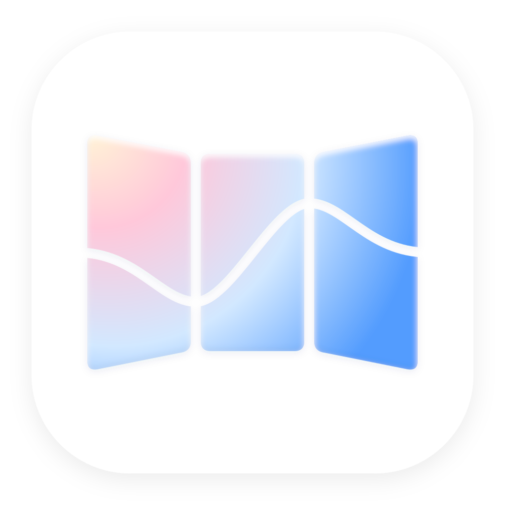
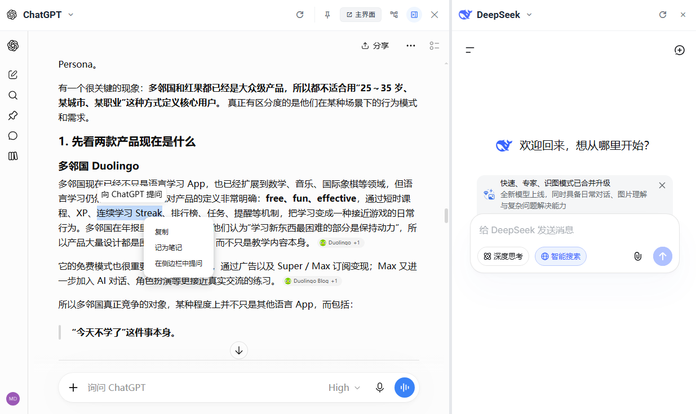
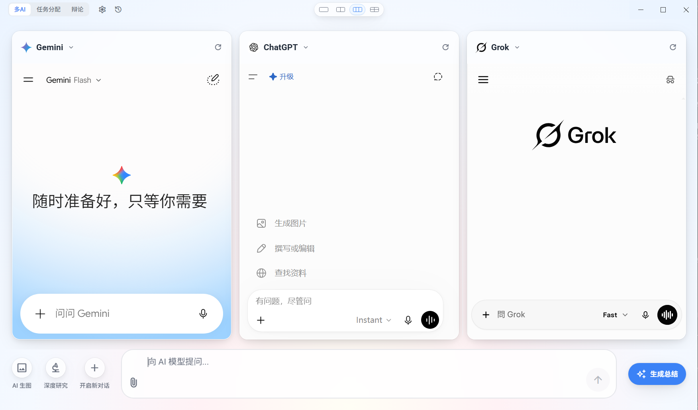
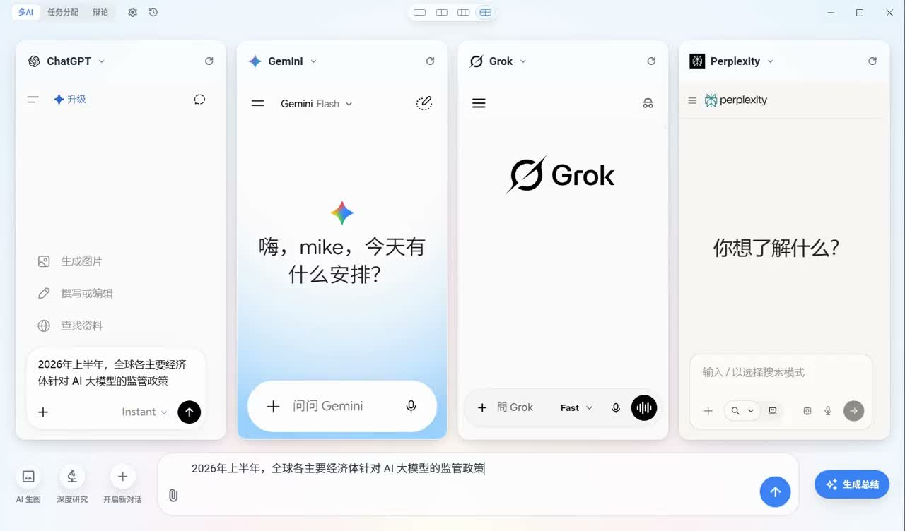
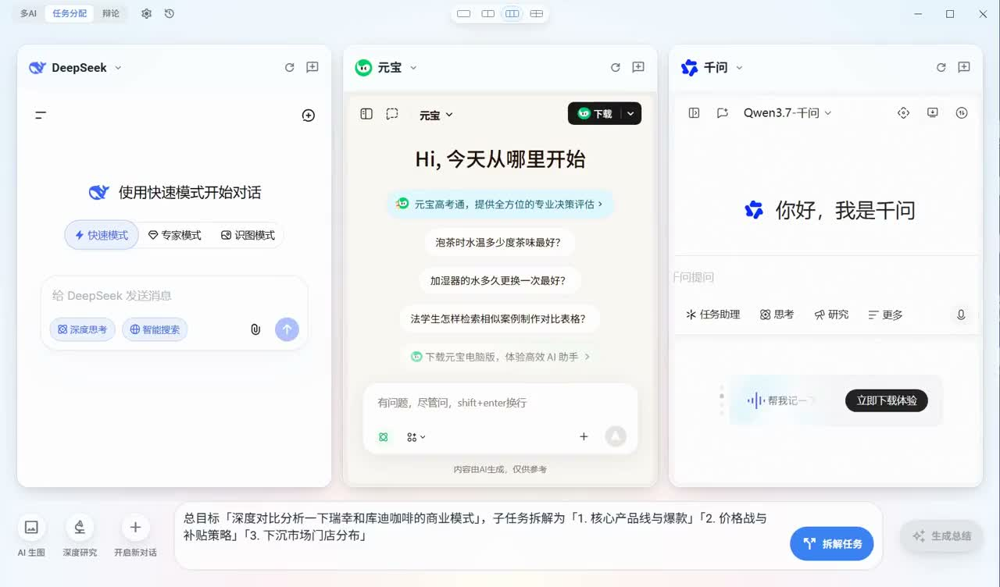
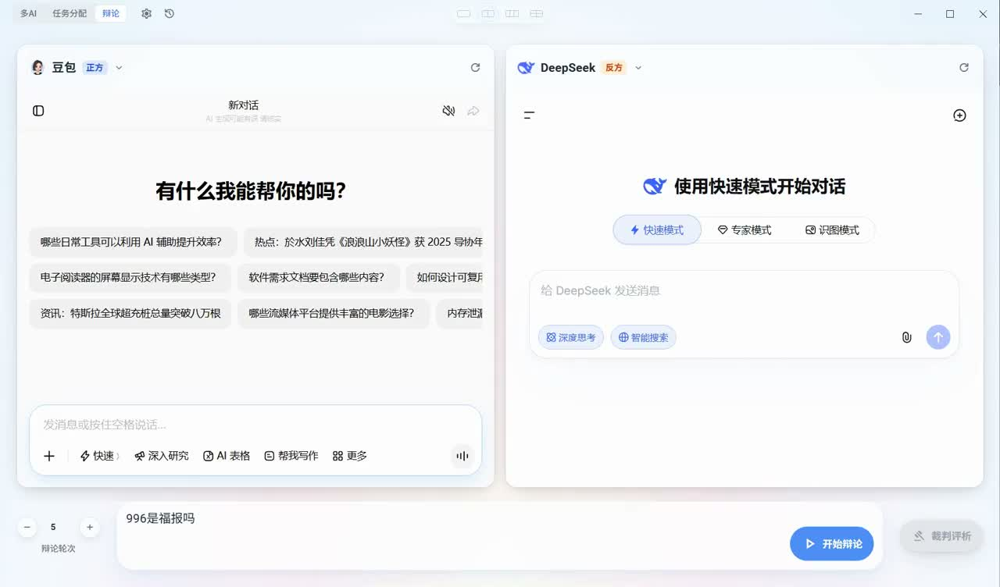

<table width="100%" border="0" cellpadding="0" cellspacing="0">
  <tr>
    <td align="left" valign="middle" width="80">
      
    </td>
    <td align="left" valign="middle">
      <div><strong><big>MultiChat Desk</big></strong></div>
    </td>
    <td align="right" valign="middle">
      <a href="#product">产品简介</a> ·
      <a href="#quick-window">快捷窗口</a> ·
      <a href="#workflows">并行工作流</a> ·
      <a href="#notes-mindmap">笔记与导图</a> ·
      <a href="#download">下载</a> ·
      <a href="#developer">开发</a>
    </td>
  </tr>
</table>

<hr />

<div align="center">
  <p><strong>多个 AI 并行思考，随时唤起、划词追问，把好答案留成笔记与导图。</strong></p>
  <p>主窗口处理复杂任务，快捷窗口陪伴日常阅读：从提问、对比到批注与整理，在同一个桌面工具里完成。</p>
  <p>
    <a href="https://github.com/max-doo/MultiChat-desk/releases"></a>
    <a href="https://github.com/max-doo/MultiChat-desk/releases"></a>
    <a href="https://github.com/max-doo/MultiChat-desk/blob/main/LICENSE"></a>
    <a href="https://www.electronjs.org/"></a>
  </p>
</div>

<p align="center">
  
</p>

> MultiChat Desk 是面向 AI 重度用户的桌面工作区，直接承载各 AI 平台的网页体验。你可以在主窗口同时询问多个 AI，也可以随时唤起快捷窗口，在阅读中追问，再把值得保留的内容整理为本地笔记和思维导图。

<a id="product"></a>
## ✨ 产品简介

### 按当前任务，选择合适的入口

| 你正在做什么 | 推荐入口 | 可以怎样使用 |
| --- | --- | --- |
| 随手提问、读长回答、处理桌面选中文字 | **快捷窗口** | 快捷键唤起，划词带入问题，在侧边栏向另一个 AI 追问 |
| 比较答案、并行调研、推敲方案 | **主窗口** | 多 AI 同题对比、拆分任务分发、正反方辩论，再汇总结果 |
| 保留关键段落、复习长对话、整理观点 | **笔记与思维导图** | 保存划词和批注，回看本地快照与原网页，生成并编辑导图 |

例如，做一次产品方案研究：先在主窗口让多个 AI 提供不同视角，再在快捷窗口精读其中一份回答，选中有疑问的段落交给侧边栏 AI 分析，最后留下批注和导图，方便后续复用。

<a id="quick-window"></a>
## ⚡ 快捷窗口：随时唤起的 AI 阅读与追问入口

日常使用 AI，常常从一个小问题或一段正在阅读的文字开始。快捷窗口提供独立的轻量入口，支持置顶、切换平台和展开侧边栏，让阅读与追问并排进行。

<p align="center">
  
</p>

*左侧保留 ChatGPT 原对话，右侧打开 DeepSeek。选中文字后，右键菜单可将它「记为笔记」或带入「在侧边栏中提问」；截图展示的是追问前的阅读与选区操作。*

### 阅读时，随手向另一个 AI 追问

1. 在快捷窗口中阅读当前 AI 的回答，展开侧边栏并选择用于追问的平台。
2. 选中需要解释、核对或进一步展开的文字，右键选择 **在侧边栏中提问**。
3. 选区会填入侧边栏当前平台的输入框，你可以补充要求后手动发送。
4. 继续保留左侧原文，对照右侧的新回答；重要段落可直接 **记为笔记**，再补充批注。

侧边栏可拖动调整宽度，也可收起。快捷窗口和主窗口的单列布局都提供侧边栏提问与思维导图入口。

### 从桌面选区进入 AI 对话

- **全局唤起**：默认按 `Ctrl+Shift+Space` 打开或隐藏快捷窗口；macOS 对应 `Cmd+Shift+Space`。可置顶使用，也可从窗口顶部进入主界面。
- **划词工具条**：在支持读取选区的应用中选中文字，通过「问问」「搜索」「总结」「翻译」「复制」处理；可在设置或托盘菜单中开关。
- **自定义快捷动作**：可为总结、润色、翻译、纯文本入框和搜索分别配置快捷键；除唤起快捷键外，这些动作默认未绑定。
- **快速切换 AI**：在窗口顶部切换平台，切换时尝试携带尚未发送的输入文本。

外部应用选区的读取取决于操作系统、应用支持和权限；Windows 是当前主要验证平台，macOS 的划词工具条需要辅助功能权限。

<a id="workflows"></a>
## 🎯 主窗口：多 AI 并行处理复杂任务

需要比较观点或组织分工时，主窗口提供统一输入和多个并排的 AI 网页窗口：先填写问题并确认，让文字进入各平台输入框，再点击发送统一触发回答。确认发送前可以取消并清空已填入的内容。

<p align="center">
  
</p>

### 三种并行工作流

| 多 AI 模式 · 横向对比 | 任务分配模式 · 智能拆解 | 辩论模式 · 全自动对抗 |
| --- | --- | --- |
|  |  |  |
| 同一问题同时发给多个 AI，回答并排出现，适合对比质量、验证事实、获得多角度意见。 | 输入总目标，AI 自动拆解成子任务，按窗口分配、可编辑，再一键发送。 | 两个窗口作为正反方轮流发言，完成多轮攻防后交给裁判总结。 |

### 多 AI 模式

- 支持单列、双列、三列、四窗布局。
- 统一输入，一次发送到当前显示的多个平台。
- 每个 Webview 独立运行，方便保留不同平台的原生能力和上下文。
- 可批量开启支持平台的 Deep Research 或 AI 生图模式。

### 任务分配模式

- 使用已配置的 API 模型拆解总目标；自动拆解需要先配置可用的供应商和模型。
- 子任务支持编辑、增删和切换指派窗口。
- 按窗口槽位分发，适合资料搜集、方案比较、分工调研等并行任务。
- 完成后可进入“成稿汇总”流程，把多个子任务结果合成可交付内容。

### 辩论模式

- 两个窗口分别承担正方和反方。
- 支持 1–10 轮辩论，自动推进立论、交锋和结辩流程。
- 自动引用上一轮发言并轮流发送，减少手动协调。
- 辩论结束后由“辩论裁决”总结按轮次追踪攻防、评分并给出裁决。

<a id="summary"></a>
### 把多个回答整理为结论

在总结页选中需要参与分析的回答，选择总结平台、预设并补充要求。应用会把整理后的内容和提示词填入该平台的网页输入框，长内容会尝试以 Markdown 附件上传；检查后，**在平台网页内手动确认发送**，再继续追问。

总结复用已登录的 AI 网页，无需额外配置总结 API Key。

| 内置总结预设 | 适合场景 |
| --- | --- |
| **综合最佳** | 多模型去重、互补和纠错，输出更完整的综合答案 |
| **裁判找茬** | 查找事实错误、逻辑漏洞和不可靠表述 |
| **辩论裁决** | 分析辩论攻防、评分并给出最终裁决 |
| **成稿汇总** | 将任务分配模式的多个子任务结果合成为成稿 |

可在 **设置 → 任务分配与总结设置** 中管理自定义总结提示词。该处的 API 供应商和模型配置用于**任务分配的自动拆解**：新增供应商，填写其 OpenAI 兼容 Base URL 与 API Key，验证并添加或同步模型后，在任务拆解弹窗中选择使用。

<a id="notes-mindmap"></a>
## 📝 笔记与思维导图：把好答案留下来

长对话中真正有价值的内容，往往是几段关键解释或一组相互关联的观点。笔记保留原文和你的判断，思维导图帮助重新梳理结构，两者都按会话归组，方便之后回看。

### 划词批注与本地会话笔记

- **在阅读现场记录**：选中文字后右键「记为笔记」，保存引文与当前可读取的对话快照，并可添加评论。
- **按会话集中查看**：在「我的笔记」中搜索标题、批注或导图，按平台与内容类型筛选。
- **对照上下文**：切换本地快照与原始网页，借助目录定位内容；点击批注可定位对应高亮，原网页高亮取决于文字是否仍可匹配。
- **导出复用**：笔记支持导出 Markdown 或 JSON，便于归档和继续整理。

本地快照保存的是采集时可读取的对话内容；网页尚未加载的旧消息、图片等非文本内容可能无法完整保留。

### 从当前对话生成可编辑的思维导图

在快捷窗口或主窗口单列布局中打开思维导图侧边栏，选择 **本地**：

1. 选择生成用的 AI 平台，可补充「重点整理核心论点」「保留不同方案的分歧」等要求。
2. 点击 **生成导图**，将当前可读取的对话交给所选 AI 网页生成大纲，导图和来源快照随后保存到笔记。
3. 直接编辑节点、增删分支、展开或收起，也可切换到 Markdown 大纲编辑，支持撤回和重做。
4. 回到「我的笔记」继续查看和编辑，按需导出 Markdown 大纲或 SVG 图。

也可以 **手动创建空白导图**，自行组织观点；侧边栏的 **在线** 选项提供幕布网页入口，使用其独立账户与在线功能。

<a id="capabilities"></a>
## 🧩 平台与其他能力

### 支持的 AI 网页平台

内置 13 个平台：ChatGPT、Claude、Gemini、Grok、Perplexity、DeepSeek、千问、Kimi、豆包、元宝、智谱清言、文心一言、Arena。

各平台保留自己的原生网页能力和账户权限，登录状态可跨应用内窗口复用。MultiChat Desk 提供统一布局、输入、发送和内容整理；平台会员、网络连通性与网页改版会影响实际可用性。

### 文件上传与对话历史

- 支持拖拽或粘贴文件到统一输入区域，并尝试同步到当前显示的模型窗口。
- 可处理图片、PDF、TXT、DOCX、Markdown、CSV、XLSX 与代码文件；实际可上传的格式和数量以各平台限制为准。
- 对话历史和总结入口记录可本地保存与恢复，方便返回之前的任务和平台会话。
- 笔记、快照与导图保存在本地；使用 AI 总结、导图生成或任务自动拆解时，相关内容会发送到你选择的网页平台或 API 供应商。

### Deep Research 与 AI 生图

工具栏提供统一入口，按当前平台的选择器配置尝试开启深度研究或 AI 生图模式；不同平台支持范围不同，未配置的平台会明确提示不支持。AI 生图结果还支持检测和批量下载流程。

<a id="download"></a>
## 🚀 下载与首次使用

### 下载

- **Windows**：前往 [GitHub Releases](https://github.com/max-doo/MultiChat-desk/releases) 下载安装版或便携版。
- **macOS / Linux**：仓库提供对应构建脚本；正式发布物、平台权限和交互行为请以目标平台的实际验证结果为准。
- **产品介绍**：访问 [MultiChat Desk 落地页](https://multichat.top)。

本文按当前仓库源码介绍功能；下载的发布包可能尚未包含最新源码改动，请结合 [变更日志](CHANGELOG.md) 和对应 Release 说明查看。

### 首次启动

1. 启动后，在需要使用的平台窗口中分别完成登录。
2. 按 `Ctrl+Shift+Space` 试用快捷窗口：选择常用 AI，阅读回答后选中文字，尝试「在侧边栏中提问」或「记为笔记」。
3. 要并行比较时，进入主界面，选择「多 AI」模式；底部输入后先确认填入，再统一发送。
4. 需要汇总时，进入总结页，选择回答、平台和预设，填入后在 AI 网页内手动发送；自动拆解任务则需先在设置中配置 API 供应商和模型。
5. 在「我的笔记」回看批注、快照与导图；也可以从对话的思维导图入口生成新图，再继续编辑或导出。


<a id="developer"></a>
## 🛠️ 开发与构建

### 技术栈

- Electron 42、React 18、TypeScript、Zustand
- Tailwind CSS、electron-vite、electron-builder
- 主进程负责窗口、Session、IPC、持久化与自动化服务；渲染进程负责界面、状态和 Webview 交互；preload 只暴露安全桥接。

### 环境要求

- Node.js 20.x 或更高版本
- npm 10.x 或更高版本
- 网络连接；部分 AI 平台可能需要代理
- Windows 是当前主要开发和发布验证平台

项目只使用 npm，不使用 pnpm、yarn 或其他包管理器。

### 安装与开发

```bash
git clone https://github.com/max-doo/MultiChat-desk.git
cd MultiChat-desk
npm install
npm run dev
```

### 检查与构建

```bash
# 静态检查
npm run lint

# 构建 main / preload / renderer / CLI
npm run build

# Windows 安装版与便携版
npm run build:win:nsis
npm run build:win:portable
npm run build:win:all

# 在对应操作系统上构建
npm run build:mac
npm run build:linux
```

构建产物位于 `out/` 或 `dist/`。这两个目录是生成目录，不要手工修改。

### 项目结构

```text
src/
├── main/       # Electron 主进程：窗口、Session、IPC、持久化与自动化服务
├── preload/    # 安全桥接与 IPC 类型契约
├── renderer/   # React 页面、状态、组件与 Webview 交互
├── shared/     # 主进程与渲染进程共享的选择器和工具
└── cli/        # CLI 与 daemon 相关入口
docs/           # 用户、构建、配置和设计文档
assets/         # 应用资源
```

第三方 AI 平台的 DOM 选择器集中维护在 [`src/shared/config/selectors.ts`](src/shared/config/selectors.ts)，注入脚本集中在 `src/shared/utils/` 与 `src/renderer/src/utils/`。调整平台自动化前，建议先阅读 [选择器维护方法论](docs/选择器维护方法论.md)。

<a id="faq"></a>
## ❓ 常见问题

### 为什么某个平台显示空白或无法发送？

先检查网络、代理和平台登录状态，再尝试刷新该窗口。第三方平台频繁改版时，也可能需要更新选择器；开发态可使用诊断页面定位输入框、发送按钮和回复容器。

### 为什么总结按钮不可用？

先确认已有可读取的回答，并在总结页选择参与分析的内容和可用的平台。任务分配的「成稿汇总」和辩论的「辩论裁决」需要相应工作流的结果；提示词填入后，还需在平台网页内手动发送。

### 普通使用需要 API Key 吗？

多 AI 同题发送、快捷窗口、笔记、网页总结和通过网页生成导图都使用平台网页账户。任务分配的自动拆解需要另行配置 API Key、兼容的 Base URL 和模型；其 API 使用费用由对应供应商决定。

### 登录信息和历史记录保存在哪里？

数据默认由 Electron 应用在本地持久化。安装版和便携版的存储位置不同，具体可参考 [用户使用指南](docs/USER_GUIDE.md) 和 [便携版构建指南](docs/PORTABLE_BUILD_GUIDE.md)。不要把包含 Cookie、API Key、历史内容的配置文件提交到 Git。

### 如何重置开发态配置？

```bash
npm run clean:store
```

该命令清理应用及开发态目录下的 `config.json` / `config-dev.json`；执行前请确认不需要保留其中的设置、历史记录和 API 配置。

### 修改平台选择器后如何验证？

先运行 `npm run lint` 和 `npm run build`，再用 `npm run dev` 在真实桌面窗口中登录并触发对应平台的发送、收集、总结或上传流程。静态检查不能替代 Webview、焦点、鼠标和平台网页的实际验收。

<a id="links"></a>
## 🔗 项目链接

- [GitHub 仓库](https://github.com/max-doo/MultiChat-desk)
- [Releases 下载](https://github.com/max-doo/MultiChat-desk/releases)
- [Issues](https://github.com/max-doo/MultiChat-desk/issues)
- [Discussions](https://github.com/max-doo/MultiChat-desk/discussions)
- [产品落地页项目](https://github.com/max-doo/MultiChat-LP)

## 📄 许可证

本项目采用 [Apache License 2.0](LICENSE) 开源。

欢迎提交 Issue、完善平台选择器、改进文档或贡献代码。提交前请确保没有包含 API Key、Cookie、Token、私有密钥或真实用户数据。
