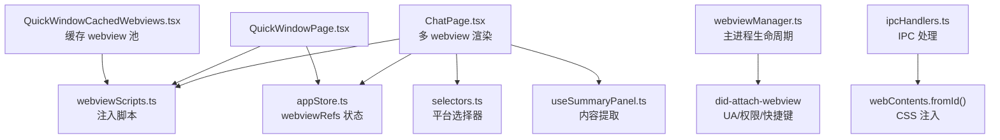
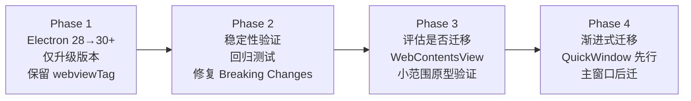

> Created: 2026-06-29 21:13 (UTC+8)

# WebView → WebContentsView 迁移可行性评估

在 Electron 框架中，`BrowserView` 和 `<webview>` 都是用于嵌入第三方 Web 内容的技术方案，但二者在架构层级、控制方式、性能表现和官方支持上存在本质差异。本文将针对 MultiChat Desk 项目的现状，评估从 WebView 升级到 WebContentsView 的可行性、潜在风险与开发成本。

---

## 一、项目现状摘要

| 维度 | 当前状态 |
|------|----------|
| **Electron 版本** | ^28.0.0（Chromium 120） |
| **WebView 数量** | 动态 3-10 个同时存在（每个 AI 平台一个） |
| **布局方式** | 纯 CSS flexbox，无手动 bounds 管理 |
| **Session 策略** | 所有 webview 共享 `persist:shared` |
| **脚本注入** | 重度使用 `executeJavaScript`（输入注入/提交触发/内容提取/CSS 注入） |
| **事件监听** | 9 种事件类型，渲染进程侧直接绑定 |
| **受影响文件** | 预估 12-15 个文件需要修改 |

### 核心依赖链路



---

## 二、升级可行性判断

### 结论：技术上可行，但需要重大架构调整

> [!IMPORTANT]
> WebContentsView 在 **Electron 30+** 才可用。当前项目使用 Electron 28，升级到 WebContentsView 的**前置条件是先升级 Electron 到 30+**，这本身就是一个大版本升级，带来独立的兼容性风险。

### 升级路径

```
Electron 28 (Chromium 120) 
  → Electron 30+ (Chromium 122+)    ← 大版本升级
    → 引入 WebContentsView API       ← 架构迁移
```

---

## 三、升级收益评估

### 确定收益

| 收益项 | 影响程度 | 说明 |
|--------|----------|------|
| **解决 ScriptProcessorNode 崩溃** | 🔴 高 | Electron 28 (Chromium 120) 的 use-after-free 在 Chromium 121+ 已修复。升级到 30+ 后可移除 AudioContext patch 注入脚本 |
| **渲染稳定性** | 🔴 高 | WebView 的 OOPIF 渲染路径导致的白屏、导航异常、事件路由错误等偶发问题将消除 |
| **输入响应** | 🟡 中 | 输入法延迟、拖拽失效等 WebView 历史遗留问题改善 |
| **多实例内存** | 🟡 中 | 7 个 webview 场景下内存占用预计降低 5-8%，冷启动加快 ~200ms |
| **官方支持保障** | 🔴 高 | WebView 未来兼容性无保障；WebContentsView 是官方长期维护的标准 API |
| **主进程 webContents 控制** | 🟡 中 | 获得完整的 webContents 对象，Session/UA/权限控制更直接 |

### 当前已有的 Workaround 清单（升级后可移除）

| Workaround | 所在文件 | 可否移除 |
|---|---|---|
| AudioContext patch（防崩溃） | `webviewScripts.ts` | ✅ 升级到 Chromium 121+ 后可移除 |
| `disable-quic` 命令行开关 | `main/index.ts` | ❌ 与 Clash TUN 相关，非 WebView 问题 |
| `disable-blink-features=AutomationControlled` | `main/index.ts` | ❌ Cloudflare 绕过，与 WebView 无关 |

---

## 四、风险与技术挑战评估

### 🔴 高风险

#### 1. Electron 大版本升级兼容性（28 → 30+）
- Electron 28→30 跨 2 个大版本，Breaking Changes 需逐一审查。
- Chromium 120→122+ 的 Web API 变化可能影响注入脚本在各 AI 平台的运行。
- `electron-builder` 和 `electron-vite` 的版本兼容性需同步验证。
- **Session API 变化**：`persist:shared` 的行为可能有细微变化。

#### 2. CSS 布局 → Bounds 管理的架构大改
当前项目**最核心的挑战**。对比如下：

```
当前 WebView 布局:
┌─────────────────────────────┐
│  BrowserWindow (React DOM)  │
│  ┌────┬────────────────────┐│
│  │Side│  .webview-container ││
│  │bar │  ┌────────────────┐││
│  │    │  │<webview> CSS 100%│
│  │    │  │  flex 自动适配   ││
│  │    │  └────────────────┘││
│  └────┴────────────────────┘│
└─────────────────────────────┘
布局由 CSS flexbox 自动管理，无需手动计算

迁移后 WebContentsView 布局:
┌─────────────────────────────┐
│  BaseWindow / BrowserWindow │
│  ┌────┐ ┌─────────────────┐│
│  │Side│ │ WebContentsView  ││
│  │bar │ │ setBounds(x,y,w,h)│
│  │(UI)│ │ 主进程手动管理   ││
│  └────┘ └─────────────────┘│
└─────────────────────────────┘
必须通过 IPC 从渲染进程传递布局信息到主进程
```

**具体影响点：**
- 侧边栏展开/收起时需实时更新所有 WebContentsView 的 bounds。
- 窗口 resize 时需同步更新。
- Summary Panel 展开/收起时需联动。
- 搜索栏、Loading 覆盖层等 UI 元素需要额外的层级管理（WebContentsView 脱离 DOM，无法被 DOM 元素直接遮挡）。
- 可拖拽分隔条（Resizer）需要跨进程布局同步，容易造成渲染不同步和视觉抖动。

#### 3. 多 WebContentsView 实例的层叠管理
当前通过 CSS `display: none/flex` 切换活跃的 webview。迁移后：
- 需要在主进程管理多个 WebContentsView 的 z-order 或视图添加/移除。
- 活跃/非活跃视图的显示/隐藏需要不同机制。
- 快捷窗口的 webview 缓存池（`QuickWindowCachedWebviews.tsx`）需要重新设计。

---

### 🟡 中风险

#### 4. 事件监听架构重构
当前渲染进程直接在 `<webview>` DOM 元素上绑定 9 种事件。迁移后，所有的事件处理都需从“渲染进程直接监听”改为“主进程监听 + IPC 转发到渲染进程”：

| 事件 | 用途 | 迁移方案 |
|------|------|----------|
| `did-start-loading` | 显示 loading | 主进程 webContents 事件 + IPC 通知渲染层 |
| `did-stop-loading` | 隐藏 loading | 同上 |
| `did-fail-load` | 错误恢复 | 同上 |
| `did-navigate` | URL 跟踪 | 同上 |
| `dom-ready` | 脚本注入 | 主进程直接注入 |
| `console-message` | 开发日志 | 主进程 webContents 事件 |
| `ipc-message` | 脚本回调 | 需重建通信通道 |
| `page-title-updated` | 标题更新 | 主进程事件 |
| `render-process-gone` | 崩溃恢复 | 主进程事件 |

#### 5. `executeJavaScript` 调用链路迁移
当前的 11 个 `executeJavaScript` 调用全部在渲染进程通过 webview DOM 方法直接执行。迁移后：
- 所有脚本执行必须经由主进程的 `webContents.executeJavaScript()`。
- 需要新增对应的 IPC 通道。
- 返回值的异步传递需要额外处理。

#### 6. `webContentsId` 映射重建
当前通过 `webview.getWebContentsId()` 获取 ID 用于 IPC 通信。迁移后：
- WebContentsView 由主进程创建和持有。
- ID 映射关系需要在主进程维护并暴露给渲染进程。
- `appStore.ts` 的 `webviewRefs` 需要完全重新设计。

---

### 🟢 低风险

#### 7. 注入脚本无需修改
- `webviewScripts.ts` 中的 493 行脚本逻辑不需要改变。
- `selectors.ts` 中的选择器定义不需要改变。
- 只是调用方式从 `webview.executeJavaScript()` 变为主进程 `webContents.executeJavaScript()`。

#### 8. Session 共享机制基本不变
- `persist:shared` Session 分区概念在 WebContentsView 中仍然适用。
- `webContents.session` 的 API 基本一致。

---

## 五、工作量评估

### 按组件拆解

| 组件 | 改动复杂度 | 预估工时 | 说明 |
|------|-----------|---------|------|
| **Electron 升级 28→30+** | 🔴 高 | 2-3 天 | Breaking Changes 审查 + 依赖兼容 |
| **主进程 WebContentsView 管理器** | 🔴 高 | 3-4 天 | 全新模块：创建/销毁/bounds/z-order |
| **布局同步 IPC 系统** | 🔴 高 | 2-3 天 | 渲染进程 → 主进程的实时布局协调 |
| **ChatPage.tsx 重构** | 🟡 中 | 2 天 | 移除 webview 标签，改为 IPC 驱动 |
| **QuickWindowPage.tsx 重构** | 🟡 中 | 1 天 | 包括缓存池重设计 |
| **事件系统迁移** | 🟡 中 | 2 天 | 9 类事件的 IPC 转发 |
| **appStore.ts 状态重设计** | 🟡 中 | 1 天 | webviewRefs → 主进程 ID 映射 |
| **webviewManager.ts 重写** | 🟡 中 | 1-2 天 | 适配新的生命周期模型 |
| **ipcHandlers.ts 扩展** | 🟡 中 | 1 天 | 新增 ~15 个 IPC 通道 |
| **preload 契约更新** | 🟢 低 | 0.5 天 | 新 IPC 的类型定义 |
| **CSS 清理** | 🟢 低 | 0.5 天 | 移除 webview 相关样式 |
| **集成测试与回归验证** | 🔴 高 | 3-4 天 | 10+ AI 平台逐一验证 |
| **合计** | | **~18-23 天** | |

---

## 六、综合建议与路线图

### 当前阶段不建议立即升级

理由：
1. **成本收益比偏高**：18-23 天的工作量，核心收益主要在稳定性和未来兼容性，而非用户可感知的功能提升。
2. **当前 Workaround 有效**：AudioContext patch 已解决最严重的崩溃问题，其他稳定性问题尚在可控范围。
3. **布局架构大改**：这是最大的风险点。当前纯 CSS 布局简洁高效，迁移到 bounds 管理会增加大量复杂度和潜在的视觉抖动。
4. **回归风险大**：10+ AI 平台的注入脚本都需要在新架构下逐一验证，任何一个平台的兼容性问题都可能导致用户体验退化。

### 推荐路径：分阶段升级



#### Phase 1：先升级 Electron 版本（保留 webviewTag）
- 升级到 Electron 30+，但**继续使用 `<webview>` 标签**。
- 这样能立即获得 Chromium 121+ 的原生 bug 修复（如 ScriptProcessorNode 崩溃）。
- `webviewTag` 虽然不推荐，但在 Electron 30+ 依然被支持。
- **此方案风险最小，收益最直接（预计仅需 2-3 天）**。

#### Phase 2：稳定性验证
- 在 Electron 30+ 上全面验证 10+ 平台的兼容性。
- 修复任何因为大版本升级导致的 Web API 兼容问题。
- 确认 `persist:shared` Session 行为一致。

#### Phase 3：小范围原型验证
- 先在 QuickWindow（单 webview 场景）试验 WebContentsView。
- 验证 bounds 管理、脚本注入、事件转发 the 完整链路。
- 评估实际开发成本和性能收益。

#### Phase 4：渐进式迁移
- 如果 Phase 3 验证通过，再迁移主窗口的多 webview 场景。
- 可以考虑共存方案：部分使用 WebContentsView，部分保留 webviewTag。

---

## 七、替代方案比较

| 方案 | 工作量 | 收益 | 风险 |
|------|--------|------|------|
| **A. 保持 Electron 28 + WebView** | 0 | 无 | WebView 未来兼容性无保障 |
| **B. 升级 Electron 30+ 继续用 WebView**（推荐首步） | 2-3 天 | 中高（崩溃修复 + 新 API 可用） | 低（Breaking Changes 可控） |
| **C. 升级 Electron 30+ 并完全迁移 WebContentsView** | 18-23 天 | 高（架构最优） | 高（布局大改 + 回归风险） |
| **D. 混合方案：WebView + 部分 WebContentsView** | 8-10 天 | 中（渐进式） | 中（两套架构并存增加维护成本） |
